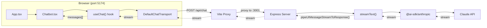
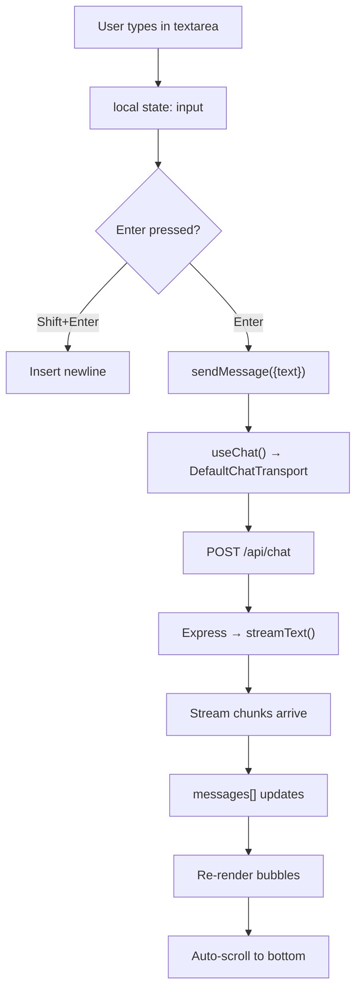
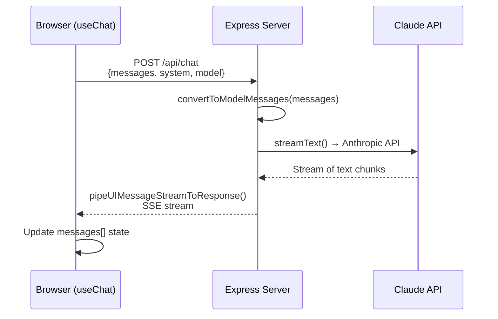
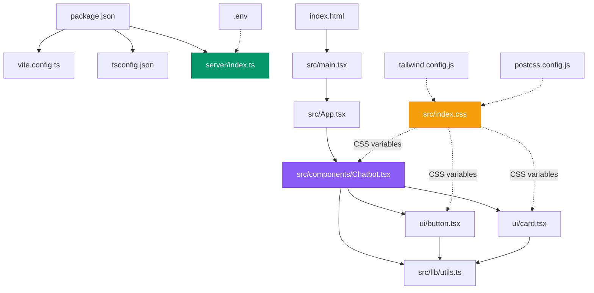

# Chatbot Project — Complete File Documentation

> [!NOTE]
> This document explains every file in the project, its purpose, how it connects to the rest of the architecture, and what you can safely edit. Use the table of contents below to jump to any section.

---

## Table of Contents

1. [Architecture Overview](#architecture-overview)
2. [Root Configuration Files](#root-configuration-files)
3. [Frontend Source Files](#frontend-source-files)
4. [shadcn UI Primitives](#shadcn-ui-primitives)
5. [The Chatbot Component](#the-chatbot-component)
6. [Backend Server](#backend-server)
7. [Editing Guide — What to Change & Where](#editing-guide)

---

## Architecture Overview



**Two processes run in development:**
| Process | Port | Role |
|---------|------|------|
| Vite dev server | 5174 | Serves React frontend, proxies `/api/*` to Express |
| Express API | 3001 | Handles chat requests, streams Claude responses |

---

## Root Configuration Files

### [package.json](file:///c:/Users/gabri/OneDrive/Desktop/Code/Hackaton/package.json)

**Purpose:** Project manifest — defines scripts, dependencies, and the AI SDK v5 version pins.

**Key sections:**

| Section | What it does |
|---------|-------------|
| `"type": "module"` | Enables ESM imports across the project |
| `scripts.dev` | Runs Vite + Express concurrently via `concurrently` |
| `scripts.build` | Type-checks (`tsc`) then builds production bundle (`vite build`) |
| `scripts.start` | Runs the Express server in production mode |

**Editable areas:**
- ✏️ Add new dependencies here
- ✏️ Modify script commands (e.g., change ports, add linting)
- ⚠️ Don't downgrade `ai`, `@ai-sdk/react`, or `@ai-sdk/anthropic` — the v5 trio must stay aligned

---

### [vite.config.ts](file:///c:/Users/gabri/OneDrive/Desktop/Code/Hackaton/vite.config.ts)

**Purpose:** Configures the Vite bundler with three key features.

```ts
plugins: [react()]          // Enables JSX/TSX + React Fast Refresh
resolve.alias: { "@": ... } // Maps @/ imports to ./src/
server.proxy: { "/api": ... } // Forwards /api/* to Express on port 3001
```

**Editable areas:**
- ✏️ Change the proxy target port if you move Express to a different port
- ✏️ Add more path aliases
- ✏️ Add Vite plugins (e.g., SVG, PWA)
- ⚠️ Don't remove the `/api` proxy — the chatbot relies on it

---

### [tsconfig.json](file:///c:/Users/gabri/OneDrive/Desktop/Code/Hackaton/tsconfig.json)

**Purpose:** TypeScript configuration for the **frontend** (`src/` directory).

Key settings:
- `"jsx": "react-jsx"` — auto-imports React for JSX
- `"paths": { "@/*": ["./src/*"] }` — enables `@/components/...` imports
- `"references"` — points to `tsconfig.node.json` for Vite config type-checking

**Editable areas:**
- ✏️ Relax strictness (e.g., disable `noUnusedLocals` during development)
- ⚠️ Keep `"paths"` in sync with `vite.config.ts` aliases

---

### [tsconfig.node.json](file:///c:/Users/gabri/OneDrive/Desktop/Code/Hackaton/tsconfig.node.json)

**Purpose:** Separate TS config for `vite.config.ts` only. Required because Vite config runs in Node (not the browser).

- Has `"composite": true` because it's a project reference
- ⚠️ Rarely needs editing

---

### [tailwind.config.js](file:///c:/Users/gabri/OneDrive/Desktop/Code/Hackaton/tailwind.config.js)

**Purpose:** Tailwind CSS configuration with the shadcn/ui design system.

**Key sections:**

| Section | Purpose |
|---------|---------|
| `darkMode: ["class"]` | Enables dark mode via `.dark` CSS class on `<html>` |
| `content` | Tells Tailwind which files to scan for class names |
| `theme.extend.colors` | Maps CSS variables (`--primary`, `--background`, etc.) to Tailwind utilities |
| `theme.extend.keyframes` | Custom `fade-in` and `pulse-dot` animations for the chatbot |
| `plugins` | Includes `tailwindcss-animate` for animation utilities |

**Editable areas:**
- ✏️ Add custom colors, fonts, spacing
- ✏️ Add new keyframes/animations
- ✏️ Extend with more Tailwind plugins
- ⚠️ Don't remove the CSS variable color mappings — shadcn components depend on them

---

### [postcss.config.js](file:///c:/Users/gabri/OneDrive/Desktop/Code/Hackaton/postcss.config.js)

**Purpose:** PostCSS pipeline — runs Tailwind and Autoprefixer on CSS.

- ⚠️ Rarely needs editing. Only modify if adding PostCSS plugins.

---

### [components.json](file:///c:/Users/gabri/OneDrive/Desktop/Code/Hackaton/components.json)

**Purpose:** shadcn/ui configuration. Used by the `npx shadcn-ui` CLI to know where to place generated components.

| Setting | Value | Meaning |
|---------|-------|---------|
| `style` | `"default"` | Uses the default shadcn component style |
| `baseColor` | `"slate"` | Base color palette |
| `cssVariables` | `true` | Uses CSS custom properties for theming |
| `aliases.components` | `"@/components"` | Where components are generated |
| `aliases.utils` | `"@/lib/utils"` | Path to the `cn()` utility |

**Editable areas:**
- ✏️ Change `baseColor` to switch theme palette
- ✏️ Update aliases if you restructure directories

---

### [index.html](file:///c:/Users/gabri/OneDrive/Desktop/Code/Hackaton/index.html)

**Purpose:** The HTML shell that Vite uses as entry point.

Key elements:
- Loads **Inter** font from Google Fonts
- Has `<div id="root">` where React mounts
- Loads `src/main.tsx` as the JS entry via `<script type="module">`

**Editable areas:**
- ✏️ Change `<title>` and `<meta>` tags for SEO
- ✏️ Add favicon, additional fonts, or external scripts
- ⚠️ Don't remove `<div id="root">` or the script tag

---

### [.env](file:///c:/Users/gabri/OneDrive/Desktop/Code/Hackaton/.env) / [.env.example](file:///c:/Users/gabri/OneDrive/Desktop/Code/Hackaton/.env.example)

**Purpose:** Environment variables. `.env` holds actual secrets (gitignored), `.env.example` is the template.

| Variable | Required | Used by |
|----------|----------|---------|
| `ANTHROPIC_API_KEY` | ✅ | `server/index.ts` — authenticates with the Claude API |
| `PORT` | ❌ | `server/index.ts` — Express port (default: 3001) |

> [!CAUTION]
> Never commit `.env` to Git. The API key gives full access to your Anthropic account.

---

## Frontend Source Files

### [src/main.tsx](file:///c:/Users/gabri/OneDrive/Desktop/Code/Hackaton/src/main.tsx)

**Purpose:** React entry point — mounts `<App />` into the DOM.

```tsx
ReactDOM.createRoot(document.getElementById("root")!).render(
  <React.StrictMode>
    <App />
  </React.StrictMode>
);
```

- ⚠️ Only edit to add global providers (e.g., theme provider, React Query)

---

### [src/App.tsx](file:///c:/Users/gabri/OneDrive/Desktop/Code/Hackaton/src/App.tsx)

**Purpose:** The demo page that showcases the `<Chatbot />` component.

**Structure:**
```
┌─────────────────────────────────┐
│   Gradient background           │
│   ┌───────────────────────┐     │
│   │  "Claude AI Chatbot"  │     │  ← h1 heading
│   │   subtitle text       │     │
│   └───────────────────────┘     │
│   ┌───────────────────────┐     │
│   │                       │     │
│   │    <Chatbot />        │     │  ← The reusable component
│   │                       │     │
│   └───────────────────────┘     │
│   "Built with React..."        │  ← footer
└─────────────────────────────────┘
```

**Editable areas:**
- ✏️ Change the heading text, description, and footer
- ✏️ Modify `<Chatbot>` props (title, system prompt, placeholder, model)
- ✏️ Add multiple chatbot instances or other components
- ✏️ Change the background gradient

**Example — change the personality:**
```tsx
<Chatbot
  title="Pirate Bot"
  system="You are a pirate. Always respond in pirate speak."
  placeholder="Ahoy! Ask me anything..."
  model="claude-haiku-4-5"
/>
```

---

### [src/index.css](file:///c:/Users/gabri/OneDrive/Desktop/Code/Hackaton/src/index.css)

**Purpose:** Global styles — Tailwind directives + shadcn CSS variable theme definitions.

**Two critical sections:**

1. **`:root`** — Light theme CSS variables (background, foreground, primary, etc.)
2. **`.dark`** — Dark theme overrides

These variables power *all* shadcn component colors. For example, `bg-primary` resolves to `hsl(var(--primary))`.

**Editable areas:**
- ✏️ Change HSL values to customize the entire color scheme
- ✏️ Add dark mode toggle by applying `.dark` class to `<html>`
- ✏️ Add custom global styles
- ⚠️ Don't remove the `@tailwind` directives — they inject Tailwind's utility classes

---

### [src/lib/utils.ts](file:///c:/Users/gabri/OneDrive/Desktop/Code/Hackaton/src/lib/utils.ts)

**Purpose:** The `cn()` utility — merges Tailwind class names intelligently.

```ts
cn("px-4 py-2", condition && "bg-blue-500", "px-6")
// → "py-2 px-6 bg-blue-500" (px-6 overrides px-4)
```

Uses `clsx` for conditional logic + `tailwind-merge` to resolve Tailwind conflicts.

- ⚠️ Don't modify — this is a standard shadcn utility used by every component

---

### [src/vite-env.d.ts](file:///c:/Users/gabri/OneDrive/Desktop/Code/Hackaton/src/vite-env.d.ts)

**Purpose:** TypeScript ambient declarations for Vite (enables `import.meta.env`, asset imports, etc.)

- ⚠️ Don't remove. Can add custom type declarations here.

---

## shadcn UI Primitives

These are hand-written from the canonical shadcn templates. They're located in `src/components/ui/` and provide the building blocks for the Chatbot UI.

### [button.tsx](file:///c:/Users/gabri/OneDrive/Desktop/Code/Hackaton/src/components/ui/button.tsx)

**Variants available:** `default`, `destructive`, `outline`, `secondary`, `ghost`, `link`
**Sizes:** `default`, `sm`, `lg`, `icon`
**Special:** `asChild` prop — uses Radix `Slot` to render a child element as the button (e.g., `<Button asChild><a href="...">Link</a></Button>`)

---

### [input.tsx](file:///c:/Users/gabri/OneDrive/Desktop/Code/Hackaton/src/components/ui/input.tsx)

**A styled `<input>` element** with focus rings, border, and disabled states. The Chatbot uses a `<textarea>` instead for multi-line support, but this component is available for other uses.

---

### [card.tsx](file:///c:/Users/gabri/OneDrive/Desktop/Code/Hackaton/src/components/ui/card.tsx)

**Exports:** `Card`, `CardHeader`, `CardTitle`, `CardDescription`, `CardContent`, `CardFooter`

The Chatbot component is wrapped in a `Card` with `CardHeader` (title), `CardContent` (messages), and `CardFooter` (input area).

---

## The Chatbot Component

### [src/components/Chatbot.tsx](file:///c:/Users/gabri/OneDrive/Desktop/Code/Hackaton/src/components/Chatbot.tsx) — ⭐ The headline deliverable

This is the **reusable, self-contained streaming chatbot**. A single import with props is all that's needed:

```tsx
import { Chatbot } from "@/components/Chatbot";
<Chatbot title="My Bot" system="You are helpful." />
```

### Props Reference

| Prop | Type | Default | Description |
|------|------|---------|-------------|
| `apiEndpoint` | `string` | `"/api/chat"` | Backend endpoint URL |
| `model` | `string` | `"claude-haiku-4-5"` | Claude model ID |
| `system` | `string` | — | System prompt injected into every request |
| `placeholder` | `string` | `"Type a message…"` | Input textarea placeholder |
| `title` | `string` | `"Chat with Claude"` | Header title |
| `className` | `string` | — | Extra CSS classes on the root Card |
| `initialMessages` | `UIMessage[]` | — | Pre-seed the conversation |

### Internal Architecture



### Key Code Sections (line references)

| Lines | Section | What it does |
|-------|---------|-------------|
| [19–34](file:///c:/Users/gabri/OneDrive/Desktop/Code/Hackaton/src/components/Chatbot.tsx#L19-L34) | `ChatbotProps` | TypeScript interface defining all configurable props |
| [48–51](file:///c:/Users/gabri/OneDrive/Desktop/Code/Hackaton/src/components/Chatbot.tsx#L48-L51) | Local state | `input` string + refs for textarea and scroll container |
| [54–60](file:///c:/Users/gabri/OneDrive/Desktop/Code/Hackaton/src/components/Chatbot.tsx#L54-L60) | `useChat()` | Connects to the server via `DefaultChatTransport` with `body: { model, system }` |
| [65–70](file:///c:/Users/gabri/OneDrive/Desktop/Code/Hackaton/src/components/Chatbot.tsx#L65-L70) | Auto-scroll | Scrolls chat to bottom when messages or status change |
| [73–79](file:///c:/Users/gabri/OneDrive/Desktop/Code/Hackaton/src/components/Chatbot.tsx#L73-L79) | Auto-resize | Textarea grows as the user types (max 120px height) |
| [82–91](file:///c:/Users/gabri/OneDrive/Desktop/Code/Hackaton/src/components/Chatbot.tsx#L82-L91) | Submit handler | Trims input, calls `sendMessage()`, clears textarea |
| [94–102](file:///c:/Users/gabri/OneDrive/Desktop/Code/Hackaton/src/components/Chatbot.tsx#L94-L102) | Keyboard handler | Enter submits, Shift+Enter adds newline |
| [105–120](file:///c:/Users/gabri/OneDrive/Desktop/Code/Hackaton/src/components/Chatbot.tsx#L105-L120) | Message renderer | Walks `message.parts` (AI SDK v5 model), renders text parts |
| [148–158](file:///c:/Users/gabri/OneDrive/Desktop/Code/Hackaton/src/components/Chatbot.tsx#L148-L158) | Empty state | Shown when no messages exist |
| [161–200](file:///c:/Users/gabri/OneDrive/Desktop/Code/Hackaton/src/components/Chatbot.tsx#L161-L200) | Message bubbles | User (green, right-aligned) vs Assistant (muted, left-aligned) |
| [203–213](file:///c:/Users/gabri/OneDrive/Desktop/Code/Hackaton/src/components/Chatbot.tsx#L203-L213) | Thinking dots | Animated pulsing dots shown during `status === "submitted"` |
| [217–232](file:///c:/Users/gabri/OneDrive/Desktop/Code/Hackaton/src/components/Chatbot.tsx#L217-L232) | Error banner | Shows error message + Retry button that calls `regenerate()` |
| [239–271](file:///c:/Users/gabri/OneDrive/Desktop/Code/Hackaton/src/components/Chatbot.tsx#L239-L271) | Input area | Textarea + Send/Stop button toggle |

### Visual Structure

```
┌─── Card ──────────────────────────────┐
│ ┌─ CardHeader ──────────────────────┐ │
│ │ 🤖 Chat with Claude              │ │
│ └───────────────────────────────────┘ │
│ ┌─ CardContent (scroll area) ───────┐ │
│ │                                   │ │
│ │  👤 User message bubble ──┐       │ │
│ │                     ┌─────┘       │ │
│ │  🤖 ┌── Assistant bubble         │ │
│ │     └─────────────────           │ │
│ │                                   │ │
│ │  ● ● ● (thinking indicator)      │ │
│ │                                   │ │
│ └───────────────────────────────────┘ │
│ ┌─ CardFooter ──────────────────────┐ │
│ │ [textarea............] [▶ Send]   │ │
│ └───────────────────────────────────┘ │
└───────────────────────────────────────┘
```

---

## Backend Server

### [server/index.ts](file:///c:/Users/gabri/OneDrive/Desktop/Code/Hackaton/server/index.ts)

**Purpose:** Express API server that proxies chat requests to Claude.

### Request/Response Flow



### Key Code Sections

| Lines | What it does |
|-------|-------------|
| [1](file:///c:/Users/gabri/OneDrive/Desktop/Code/Hackaton/server/index.ts#L1) | `import "dotenv/config"` — loads `.env` at startup |
| [12–29](file:///c:/Users/gabri/OneDrive/Desktop/Code/Hackaton/server/index.ts#L12-L29) | `POST /api/chat` — the main route |
| [14](file:///c:/Users/gabri/OneDrive/Desktop/Code/Hackaton/server/index.ts#L14) | Destructures `messages`, `system`, `model` from request body |
| [16–20](file:///c:/Users/gabri/OneDrive/Desktop/Code/Hackaton/server/index.ts#L16-L20) | `streamText()` — calls Claude via `@ai-sdk/anthropic` |
| [17](file:///c:/Users/gabri/OneDrive/Desktop/Code/Hackaton/server/index.ts#L17) | Model selection: uses `model` from body, defaults to `claude-haiku-4-5` |
| [19](file:///c:/Users/gabri/OneDrive/Desktop/Code/Hackaton/server/index.ts#L19) | `convertToModelMessages()` — converts UI messages to the format Claude expects |
| [22](file:///c:/Users/gabri/OneDrive/Desktop/Code/Hackaton/server/index.ts#L22) | `pipeUIMessageStreamToResponse(res)` — streams the result back as SSE |
| [55–58](file:///c:/Users/gabri/OneDrive/Desktop/Code/Hackaton/server/index.ts#L55-L58) | Server startup on PORT (default 3001) |

**Editable areas:**
- ✏️ Change the default model on [line 17](file:///c:/Users/gabri/OneDrive/Desktop/Code/Hackaton/server/index.ts#L17)
- ✏️ Add rate limiting, authentication, or CORS middleware
- ✏️ Add more API routes for other features
- ⚠️ Don't change the response format — the frontend `DefaultChatTransport` expects the UI message stream protocol

---

### [server/tsconfig.json](file:///c:/Users/gabri/OneDrive/Desktop/Code/Hackaton/server/tsconfig.json)

**Purpose:** TypeScript config for the server directory only. Uses ESNext module resolution to work with `tsx`.

- ⚠️ Rarely needs editing

---

## Editing Guide

### Common Changes

````carousel
### 🎨 Change the Color Scheme

Edit the CSS variables in [src/index.css](file:///c:/Users/gabri/OneDrive/Desktop/Code/Hackaton/src/index.css):

```css
:root {
  --primary: 262 83% 58%;        /* violet → change to any HSL */
  --primary-foreground: 210 40% 98%;
  --background: 0 0% 100%;
  /* ... */
}
```

All components automatically update because they use `bg-primary`, `text-foreground`, etc.

<!-- slide -->

### 🤖 Change the AI Model

Edit the default in [server/index.ts line 17](file:///c:/Users/gabri/OneDrive/Desktop/Code/Hackaton/server/index.ts#L17):

```diff
- model: anthropic(model ?? "claude-haiku-4-5"),
+ model: anthropic(model ?? "claude-sonnet-4-20250514"),
```

Or pass the model per-chatbot via the `model` prop:

```tsx
<Chatbot model="claude-sonnet-4-20250514" />
```

<!-- slide -->

### 💬 Change the System Prompt

Pass it as a prop in [App.tsx](file:///c:/Users/gabri/OneDrive/Desktop/Code/Hackaton/src/App.tsx):

```tsx
<Chatbot
  system="You are a pirate. Always respond in pirate speak. Say 'Arrr!' at least once per message."
  title="Pirate Bot 🏴‍☠️"
/>
```

The system prompt is sent with every request to Claude.

<!-- slide -->

### 📐 Change the Chat Card Size

Edit the Card className in [Chatbot.tsx line 125](file:///c:/Users/gabri/OneDrive/Desktop/Code/Hackaton/src/components/Chatbot.tsx#L125):

```diff
- "flex flex-col w-full max-w-[480px] h-[640px] ...",
+ "flex flex-col w-full max-w-[600px] h-[800px] ...",
```

Or pass it via the `className` prop:
```tsx
<Chatbot className="max-w-[600px] h-[800px]" />
```

<!-- slide -->

### 🔌 Change the API Port

1. Set `PORT` in [.env](file:///c:/Users/gabri/OneDrive/Desktop/Code/Hackaton/.env):
   ```
   PORT=4000
   ```

2. Update the proxy in [vite.config.ts](file:///c:/Users/gabri/OneDrive/Desktop/Code/Hackaton/vite.config.ts):
   ```diff
   - "/api": "http://localhost:3001",
   + "/api": "http://localhost:4000",
   ```
````

### File Dependency Map

> [!IMPORTANT]
> This shows which files depend on which. If you edit a file, check its dependents for breaking changes.



### Version Alignment

> [!WARNING]
> The AI SDK v5 trio **must** stay aligned. If you upgrade one, upgrade all three:

| Package | Required Range | Purpose |
|---------|---------------|---------|
| `ai` | `^5.0.0` | Core: `streamText`, `convertToModelMessages`, `DefaultChatTransport` |
| `@ai-sdk/react` | `^2.0.0` | React hook: `useChat()` |
| `@ai-sdk/anthropic` | `^2.0.0` | Anthropic provider: `anthropic()` model factory |

Mixing v4 and v5 packages causes silent stream parsing failures.
