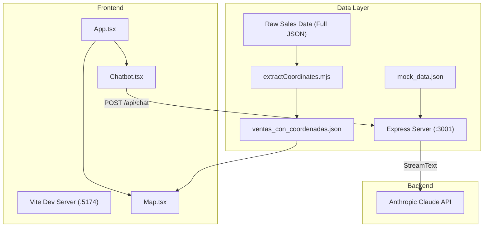

# Project Documentation: Chatbot & Geospatial Heatmap

This document provides a comprehensive overview of the repository's architecture, key components, data flow, and dependencies.

## 1. Architecture Overview

The project is a full-stack application split into a React frontend and an Express backend. It features two primary components:
1. **AI Chatbot**: A streaming assistant powered by Claude (Anthropic), provided with store context data.
2. **Geospatial Heatmap**: An interactive map visualization showing store sales density across different dates.

### Data Flow & Execution



## 2. Key Dependencies

The project relies on specific versions of several core libraries. Maintaining version alignment is crucial, especially for the AI SDK and Deck.gl.

### 🤖 AI Chatbot Dependencies
- `ai` (^5.0.0): Core Vercel AI SDK for managing streaming text and chat state.
- `@ai-sdk/react` (^2.0.0): React hooks (`useChat`) for UI integration.
- `@ai-sdk/anthropic` (^2.0.0): Anthropic provider for the AI SDK.
- *Note: These three packages must be kept in sync (v5 trio).*

### 🗺️ Geospatial & Heatmap Dependencies
- `deck.gl` (^9.3.1): High-performance WebGL-powered data visualization.
- `@deck.gl/aggregation-layers`: Provides the `HeatmapLayer` used to visualize sales density.
- `maplibre-gl` (^5.24.0): Open-source mapping library used as the base map provider.
- `react-map-gl` (^8.1.1): React wrapper for MapLibre, allowing seamless integration with Deck.gl.

### 🛠️ Infrastructure & UI
- `vite` / `express` / `concurrently`: Development pipeline to run frontend and backend simultaneously.
- `tailwindcss` / `shadcn/ui`: Utility-first CSS and accessible UI primitives.

## 3. Core Components

### `src/components/Map.tsx`
 Renders the geographical sales data.
- **DeckGL & HeatmapLayer**: Renders data points extracted from the JSON file. The `radiusPixels` property dynamically scales with the `zoom` level to maintain a consistent geographical size across zoom levels.
- **MapLibre**: Renders the underlying "dark-matter" styled street map.
- **Filtering**: Includes an overlay to filter sales by date.

### `src/components/Chatbot.tsx`
A reusable, self-contained chat component.
- Handles user input, auto-resizing textareas, and streaming responses.
- Connects to the Express backend via the `useChat()` hook.

### `server/index.ts`
The Express backend.
- Reads `mock_data.json` at startup to provide the LLM with context about products and prices.
- Exposes `POST /api/chat` to proxy requests to the Anthropic API.

## 4. Scripts & Data Processing

### `scripts/extractCoordinates.mjs`
Since the original raw sales data only contained Google Maps URLs, this script processes the data to make it usable by Deck.gl.
- **Input**: `Data/ventas_diarias_carrera5_santamarta_full.json`
- **Process**: Uses regular expressions to extract latitude and longitude from the `@lat,lng` segment of the Google Maps URL. Group sales by store and aggregates dates.
- **Output**: `Data/ventas_con_coordenadas.json` (Consumed directly by `Map.tsx`).

To run the script manually if data changes:
```bash
npm run extract-coords
# or
node scripts/extractCoordinates.mjs
```

## 5. Environment Variables

Create a `.env` file in the root based on `.env.example`:
```env
ANTHROPIC_API_KEY=your_api_key_here
PORT=3001
```

## 6. How to Run

Start both the frontend and backend servers concurrently:
```bash
npm install
npm run dev
```
- Frontend available at: `http://localhost:5174`
- Backend API running on: `http://localhost:3001`
